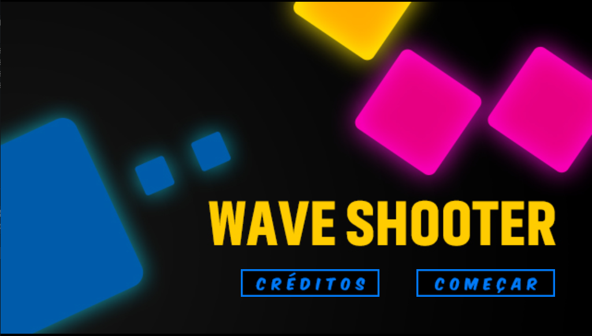
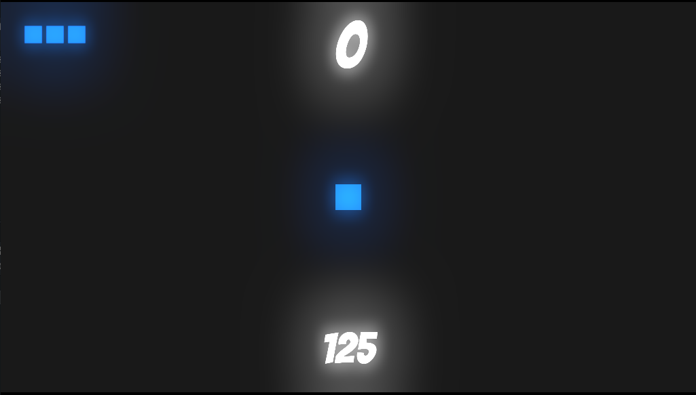
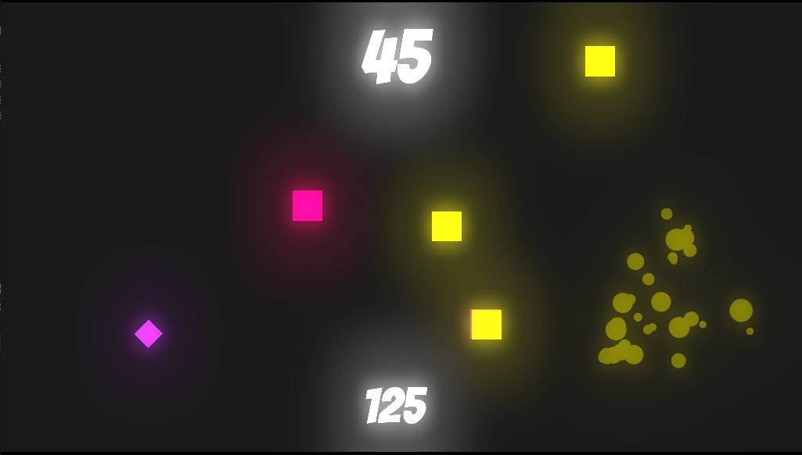
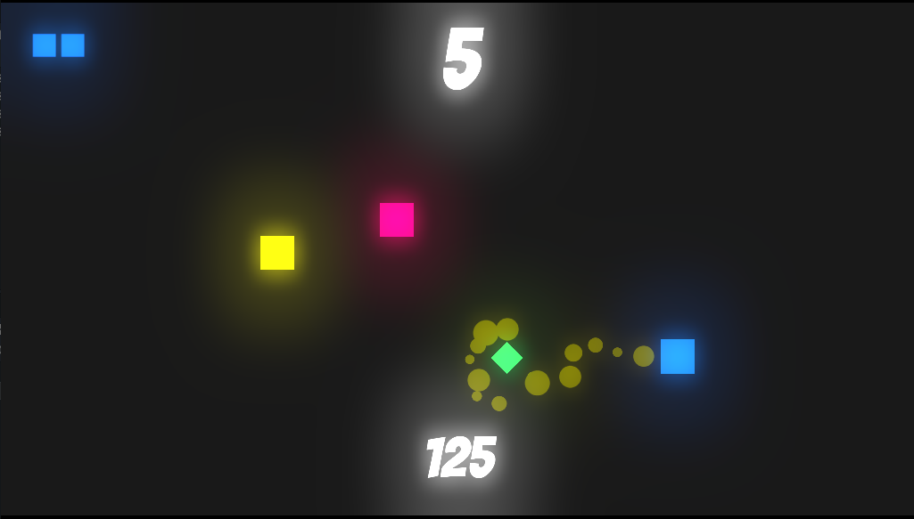

<h1 align="center">SHOOTER</h1>

  
  
  
  

## Tecnologias

Esse projeto foi desenvolvido com as seguintes tecnologias:

- [Godot Engine](https://godotengine.org/)

## Projeto

Shooter é um jogo de plataforma classico, tente sobreviver o maior tempo possível
pegando os power up's e matando os inimigos

## Para rodar o game:

  - Clone o repositorio, depois import o jogo com a Godot
